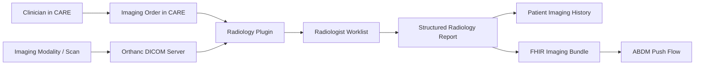
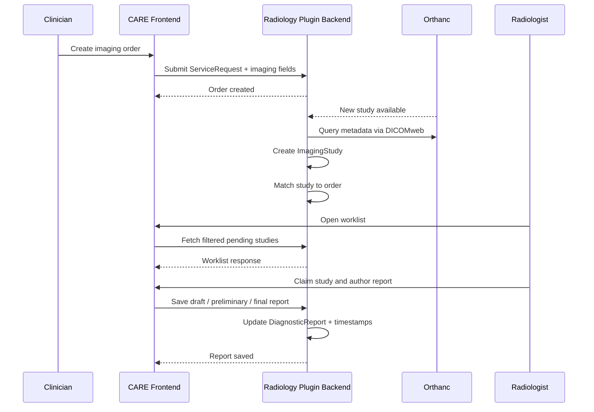

# Radiology Plugin Proposal Architecture

## Overview

This document explains the architecture behind the proposed CARE radiology plugin and how the pieces fit together as an end-to-end imaging workflow. The goal is to turn radiology inside CARE into a first-class, FHIR-native workflow instead of leaving imaging as an external or partially tracked process.

At a high level, the proposal introduces a full imaging lifecycle:

1. A clinician creates an imaging order inside CARE.
2. The imaging study is performed and stored in Orthanc.
3. CARE ingests the study metadata and links it back to the original order.
4. A radiologist claims the study from a dedicated worklist and authors a report.
5. The finalized report is stored as a structured radiology result with proper references to the imaging study.
6. The result becomes visible in patient history and can later be pushed through the ABDM integration flow.

The main idea is to make imaging in CARE behave the same way labs already do in LMIS: ordered, processed, reviewed, finalized, and interoperably shared.

## Problem the Proposal Solves

CARE already has strong support for clinical workflows, lab workflows, and ABDM integration, but imaging is still a gap. The proposal closes that gap by providing:

- Imaging order capture inside the consultation workflow
- Study ingestion from a PACS-compatible DICOM server
- A radiologist-facing operational worklist
- Structured report authoring and report state transitions
- Patient-level imaging history
- Standards-based FHIR output for future ABDM and interoperability use

Without this workflow, imaging often falls back to paper processes, disconnected systems, or weak attachment-based reporting. The proposal replaces that with a connected model where orders, images, and reports are linked all the way through.

## Architectural Principles

The proposal is built around a few key architectural choices:

- Plugin-first design: radiology should be a self-contained CARE module rather than invasive core customization.
- FHIR-native modeling: ServiceRequest, ImagingStudy, and DiagnosticReport are the backbone of the workflow.
- Standards-based integration: DICOMweb is used for image-side interoperability and FHIR is used for application-side interoperability.
- Parity with LMIS patterns: radiology is treated as a sibling workflow to labs, not a separate ad hoc subsystem.
- Incremental rollout: the core clinical workflow is delivered first; analytics, ABDM push, and OHIF embedding follow after the base flow is stable.

## System Context

The proposal sits between CARE, Orthanc, and the eventual ABDM push flow.

## Core Domain Model

The proposal uses a small set of tightly related entities.

### 1. Imaging Order

This begins as a CARE-side imaging request and maps to FHIR `ServiceRequest`.

Key fields include:

- Patient
- Encounter / consultation context
- Modality
- Body site
- Laterality
- Contrast requirement
- Clinical indication
- Priority
- Requested facility
- Status
- Accession number or linkage identifier

This is the source of truth for what was requested and why.

### 2. Imaging Study

This represents the performed study and maps to FHIR `ImagingStudy`.

Key fields include:

- Study UID
- Accession number
- Linked patient
- Linked order
- Modality
- Study date/time
- Series count
- Instance count
- Facility / device metadata
- DICOM-derived descriptors

This bridges the order world and the image world.

### 3. Diagnostic Report Imaging

This is the radiologist-authored output and maps to FHIR `DiagnosticReport` with references to the related `ImagingStudy`.

Key fields include:

- Findings
- Coded conclusion
- Impression
- Report status
- Critical result flag
- Optional signed PDF
- Linked radiologist
- Timestamps for draft / preliminary / final / amended states

This becomes the formal clinical result.

## End-to-End Workflow

### Step 1. Imaging order creation

A clinician places an imaging order inside CARE during consultation. Instead of building an isolated ordering tool, the proposal extends the existing `ServiceRequest` workflow with imaging-specific data.

This means CARE already owns:

- Why the study was ordered
- Who ordered it
- Which patient and encounter it belongs to
- What modality and body site were requested

### Step 2. Study performed and stored in Orthanc

After acquisition, the study lands in Orthanc. Orthanc acts as the DICOM-facing system and source of imaging metadata.

The proposal integrates with Orthanc using DICOMweb:

- `QIDO-RS` for querying studies
- `WADO-RS` for retrieving study content or metadata
- `STOW-RS` for storage workflows when needed

### Step 3. Ingestion into CARE

A polling task or webhook-driven mechanism detects new studies in Orthanc. CARE then:

- Reads study metadata
- Creates or updates the local `ImagingStudy` record
- Matches the study to an existing imaging order, primarily using accession number linkage
- Marks the workflow as ready for radiologist review

This is the point where the order and the actual study become connected.

### Step 4. Radiologist worklist

Radiologists work from a dedicated queue. This is a core operational screen, not just a viewer.

The worklist supports:

- Filtering by modality
- Filtering by priority
- Filtering by status
- Filtering by date and facility
- Claiming a study
- Tracking progress from ordered to in-progress to reported or final

This is what makes the plugin usable day to day in a real department.

### Step 5. Report authoring

Once a radiologist opens a study, they author the report using structured inputs:

- Findings
- Conclusion
- Impression
- Critical result flag
- Optional uploaded PDF

The authoring flow also enforces state transitions:

- Draft
- Preliminary
- Final
- Amended

This gives the reporting lifecycle clinical meaning and makes turnaround-time analytics possible later.

### Step 6. Patient history and interoperability

Finalized imaging results become visible on the patient record as part of the imaging history. Because the data remains FHIR-aligned, it can later be serialized into standards-compliant bundles for ABDM or other external consumers.

## Integration Boundaries

### CARE frontend

The frontend owns the user-facing workflows:

- Order entry
- Worklist
- Report authoring
- Patient imaging history
- Later, analytics and embedded viewer integration

### CARE backend / plugin

The backend owns:

- Imaging domain models
- REST APIs
- FHIR serialization
- RBAC enforcement
- Order-to-study matching
- State transitions
- Background jobs for Orthanc sync

### Orthanc

Orthanc is treated as the imaging-system integration point rather than something CARE tries to replace. CARE consumes study metadata and references, while image lifecycle and DICOM semantics remain on the Orthanc side.

### ABDM plugin

ABDM is a downstream integration target, not the first implementation milestone. The proposal intentionally completes the core imaging workflow before wiring the output into ABDM push flows.

## Relationship to Existing CARE Modules

### LMIS as the reference pattern

LMIS already proves that CARE can support a diagnostic workflow end to end:

- Order captured in CARE
- Work tracked operationally
- Result generated and stored
- Data exposed in clinically useful ways

Radiology follows the same shape, but with imaging-specific standards and study objects.

### Existing ServiceRequest work

The proposal extends existing `ServiceRequest` UI and workflow patterns rather than replacing them. That lowers risk and keeps the imaging order flow aligned with CARE's broader ordering model.

### ABDM integration

The proposal reuses the existing ABDM integration direction by adding imaging-capable report bundles after the core workflow is stable. In other words, radiology becomes another record type CARE can push, rather than a separate integration architecture.

## Data Flow in More Detail

## Proposed Backend Responsibilities

The backend part of the proposal is responsible for:

- Modeling imaging order metadata not covered by plain generic requests
- Storing imaging studies and their series/instance summaries
- Maintaining report state transitions
- Matching studies to orders
- Publishing report data through REST APIs
- Producing FHIR-compliant resources
- Supporting background ingestion and later analytics aggregation

In the proposal timeline, this backend foundation comes first because the frontend workflows depend on it.

## Proposed Frontend Responsibilities

The frontend part of the proposal is responsible for turning the backend model into a usable clinical workflow:

- Imaging order form in consultation
- Radiologist worklist
- Report authoring workspace
- Patient imaging history
- Later analytics widgets and possibly embedded image viewing

The frontend is intentionally role-aware:

- Clinicians need ordering and history
- Radiologists need queue management and authoring
- Administrators later need TAT visibility

## Reporting and State Management

A major part of the proposal is that reports are not a single flat text field. They move through meaningful clinical states.

Expected states:

- Ordered
- In Progress
- Reported / Preliminary
- Final
- Amended

This matters because:

- it mirrors real radiology workflow
- it supports accountability and traceability
- it creates timestamps needed for turnaround metrics
- it allows different UI behavior for editable versus finalized reports

## Standards and Interoperability

The proposal is strong because it is based on existing healthcare standards instead of custom one-off schemas.

### FHIR

FHIR is used for:

- `ServiceRequest` for imaging orders
- `ImagingStudy` for performed studies
- `DiagnosticReport` for finalized reports

This makes the plugin interoperable and aligned with CARE's architecture.

### DICOM and DICOMweb

DICOMweb is used for external imaging integration:

- `QIDO-RS` for search
- `WADO-RS` for retrieval
- `STOW-RS` for storage

This keeps the plugin compatible with common PACS and imaging server patterns.

### Terminology

The proposal uses coded values where possible:

- SNOMED CT for body sites and clinical coding
- ICD or SNOMED-linked conclusions where appropriate
- Existing FHIR-compatible terminologies used by CARE

## Milestone-Based Delivery Strategy

The proposal is intentionally phased.

### Phase 1. Backend foundation

The first phase establishes:

- Plugin scaffold
- Models
- APIs
- FHIR serialization
- Orthanc ingestion
- Order-to-study linking
- State machine basics

This phase delivers the core backend pipeline.

### Phase 2. Frontend workflows

The second phase delivers:

- Imaging order entry
- Radiologist worklist
- Report authoring
- Patient imaging history
- End-to-end tests and UI polish

This phase makes the workflow usable by actual users.

### Phase 3. Secondary goals

Only after the workflow is stable:

- TAT analytics
- ABDM push integration
- OHIF embedding as a stretch goal
- Final deployment and developer documentation

This ordering is important. The proposal is not trying to solve analytics or embedded viewing before the clinical workflow itself exists.

## What the Current Prototype Demonstrates

The current frontend prototype in this repository demonstrates the shape of the workflow:

- Worklist-first navigation
- Study filtering and claiming
- Report authoring
- Patient-facing history concepts
- Analytics placeholders
- CT preview imagery for local review

It is best understood as a workflow prototype rather than the finished production plugin. The proposal architecture explains how this UI would connect to real CARE plugin models, Orthanc ingestion, and FHIR-based backend services.

## What We Are Doing in This Project

In practical terms, this project is doing the following:

- Defining imaging as a complete CARE workflow instead of a future placeholder
- Modeling radiology using the same architectural discipline already used for labs
- Connecting CARE to an imaging server through DICOMweb
- Giving radiologists an operational workspace inside CARE
- Producing structured reports that are clinically useful and interoperable
- Preparing the path for ABDM-compliant imaging exchange

The proposal is not just "adding a screen." It is introducing a missing diagnostic subsystem with:

- order management
- study ingestion
- workflow operations
- structured reporting
- patient longitudinal access
- standards-based interoperability

## Why This Architecture Makes Sense

This design fits CARE well because it reuses the platform's strongest patterns:

- plugin-based modularity
- FHIR-native data structures
- existing order and diagnostic patterns
- existing ABDM direction
- proven operational workflows from LMIS

That makes the proposal ambitious, but still realistic. It is not fighting the platform. It is extending the platform in a direction it already clearly intends to support.

## Future Extensions

Once the base workflow is stable, the architecture supports several natural extensions:

- OHIF viewer embedding
- voice dictation or CARE Scribe integration
- richer QA workflows
- notification routing for critical findings
- facility-level workload balancing
- deeper analytics and SLA dashboards
- broader PACS compatibility beyond Orthanc

## Conclusion

The proposal architecture is designed to bring radiology into CARE as a first-class, standards-based, operationally useful workflow. It starts from order creation, connects to DICOM imaging infrastructure, supports radiologist reporting, and finishes with interoperable clinical output.

That is the core idea behind the proposal: close the missing imaging gap in CARE with an architecture that is practical, incremental, and aligned with how the rest of the platform already works.
